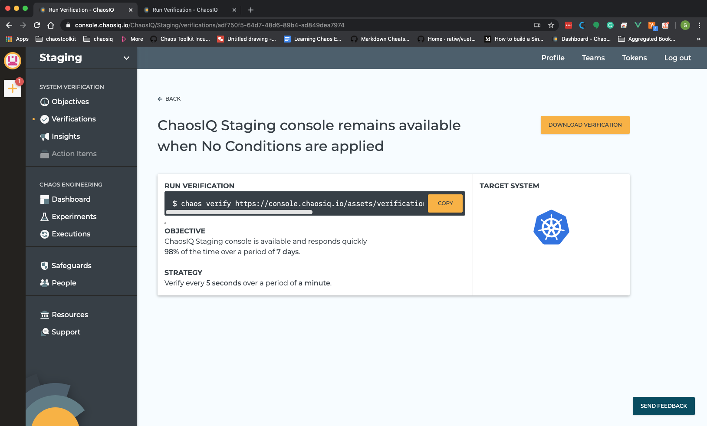
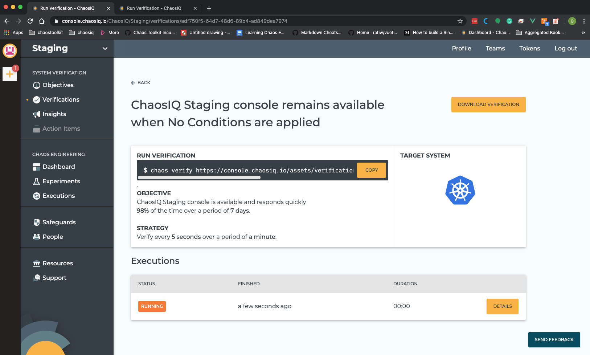
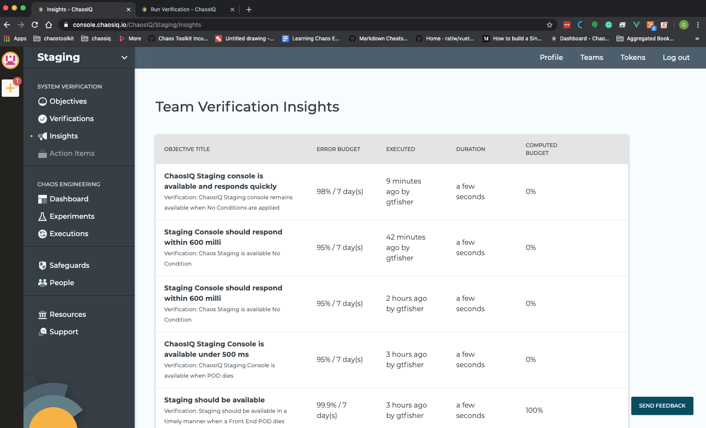

# Getting Started with ChaosIQ

This document will show you the steps to run your first Verification with the Chaos Toolkit and publish the results to ChaosIQ.

The workflow in ChaosIQ is organized around [Objectives](objectives) and [Verifications](verification). Objectives identify the parts of your system that you care about and are highly related to what keeps your users happy. Verifications explore the impact on your objectives under various conditions, such as failures.

We will go through the steps required to get your first Verification running and published into ChaosIQ:

1. Install the Chaos Toolkit CLI.
1. Sign-in to ChaosIQ with your credentials.
1. Create your first Observation.
1. Create your first Verification.

## Install the Chaos Toolkit CLI

**If you’ve already got a working installation of the Chaos Toolkit CLI then you can skip directly to [Signin to ChaosIQ with your credentials](#signin-to-chaosiq-with-your-credentials)**

### Creating a new Chaos Toolkit CLI Installation using pip

The Chaos Toolkit CLI is implemented in Python 3 and so needs a working Python installation at version 3.5+. When you execute the python3 command on your machine you see something like the following then you are all set:

```
$ python3 --version
Python 3.7.6
```

If you see a version lower than 3.5 then you’ll first need to install a later version of Python. This is well documented on the [Chaos Toolkit install page](https://docs.chaostoolkit.org/reference/usage/install/)

#### Create a Python Virtual Environment

Dependencies can be installed for your Python installation through pip and it’s often a good idea to create a Python [Virtual Environment](https://docs.python.org/3/tutorial/venv.html) to contain your Chaos Toolkit CLI installation libraries.

To create a Python virtual environment called chaostk execute the following:

```
python3 -m venv ~/.venvs/chaostk
```

Now you can activate your virtual environment by executing:

```
$ source  ~/.venvs/chaostk/bin/activate
  (chaostk) $
```
  The [virtualenvwrapper](https://virtualenvwrapper.readthedocs.io/en/latest/) is a great tool
  that simplifies working with Python virtual environments.

#### Install the Chaos Toolkit CLI using pip

You install the Chaos Toolkit CLI as the Python chaostoolkit module into your virtual environment by using pip:

```
(chaostk) $ pip install chaostoolkit
```

You can verify the Chaos Toolkit CLI was installed by running:

```
(chaostk) $ chaos --version
chaos, version 1.4.1
```

*That’s it!* You’ve got a working installation of the Chaos Toolkit CLI. The next step is to set up your Chaos Toolkit CLI to use your ChaosIQ account and run and publish your first experiment to your ChaosIQ console

#### Add ChaosIQ to your Chaos Toolkit CLI installation

ChaosIQ is added to your Chaos Toolkit as a [plugin](https://github.com/chaosiq/chaosiq-cloud). The ChaosIQ features can be added to your Chaos Toolkit CLI installation by executing:

```
(chaostk) $ pip install chaosiq-cloud
```

### Sign-in to ChaosIQ with your Credentials

So that your Chaos Toolkit installation can interact with ChaosIQ, you need to set up your credentials using the `chaos signin` command. A token is generated from the  ChaosIQ [Tokens tab](https://console.chaosiq.io/tokens).


Enter a token name and click the `Generate Token` button:


Click the `Copy To Clipboard` button and the token will be copied to your clipboard, ready to be added to your Chaos Toolkit CLI by signing into ChaosIQ.

Use the `chaos signin` command to connect to ChaosIQ and add your token. When the `chaos signin` command prompts for the token, paste the token from your clipboard:

```
(chaostk) $ chaos signin
  ChaosIQ Cloud url [https://console.chaosiq.io]:
  ChaosIQ Cloud token:
  Experiments and executions will be published to organization 'MyName'
  ChaosIQ Cloud details saved at ~/.chaostoolkit/settings.yaml
```

### Create your first Objective

Ensure you have a team selected using the drop-down at the to left of the ChaosIQ console.


Then navigate to the [Objectives page](https://console.chaosiq.io/ChaosIQ/Staging/objectives) and click the `Create a New Objective` button.

 On the `Objective` form specify an Objective you care about for your system. First you need to add a meaningful name for your Objective. An objective's name should mean something of value to the business or the your customers. You can also add an optional description to elaborate on your Objective. 
 
 You can optionally add a tag to your Objective. Tags are used to filter for your objective when you are managing many Objectives.

You now specify the most important part of your objective which is a target percentage availability over a specified period, an example could be 99.5% available, over a period of 7 days. The target availability is less than 100% so this leaves a margin for error, this can be considered the [Error Budget]().


The next step is to identify how you would measure your Objective. This is something in your that you can measure that is an indicator that the system is meeting its objectives. In ChaosIQ, select the drop-down menu for the type of measurement.

!!! note
    Currently there are a limited number of options for the type of measurement but these should expand over time as ChaosIQ evolves. 

Select a measure from the drop-down such as `HTTP status code`.

The fields displayed on the `Create Objective` form will dynamically update depending on the drop-down field you have selected. For HTTP status code you will be able to enter a URL you are going to probe and a tolerance for that probe.

The tolerance can be either HTTP Status Code Check where you will specify an explicit expected status code as a response. Alternatively, you could select a range of HTTP Status codes, where you specify a lower and upper bound for the expected response code.


Having identified how you are going to measure your objective select the *Create Objective and Verify It* button to complete your objective and it will take you to the Create a Verification form.


### Create your first Verification


The first part of the Verification form links the Verification to the Objective you have just created. You can optionally change this to another Objective via the drop down list. In part 2 of the form you give you Verification a name that reflects what this Verification is going to do, an example could be is Ensure My Service remains available when a Web Service POD restarts. Then you will enter a frequency in seconds and over what duration your Verification will be run. The values chosen on these fields impact your usage footpriont in ChaosIQ so a high usage warning may be displayed.

The third Part of the Verification form identifies the conditions you want to apply as part of you Verification.

The first option is to apply No Condition, this means you are going to measure you Verification but you are not going to apply an adverse effect as part of your Verification. This is a good case for a control Verification as it establishes how the Verification performs in normal conditions. In this case leave the condition as No Condition and select the *Create Verification and View Execution Steps* button.

### Run your Verification



ChaosIQ will display the Run Verification page showing the Chaos Verify command with a URL selecting you Verification. To run the Verification select the *Copy* button, which will capture the command in your clipboard.  Open the terminal window where you set-up your Chaos Toolkit and paste in the Chaos Verify command and select enter to run it. The command should run the Verification and publish the results to ChaosIQ. If you go to the Verifications page and select your Verification, you should be able to see the current state of the
Verification.



 The Insights page will give you a view of your Verifications that have completed. This will give you an indication of the timeline of the Verification and a view of the events that occurred when the Verification was running. It is from the insights page that you should be able to learn the impact of your Verification and determine what actions are required. To view, the results select the Insights menu option.

 

 That's your first Verification created, run and published to ChaosIQ and the results are now made available on the Insights page. Next steps are to add Conditions to your Verification to see what, if any, impact this might have on your Objective.
